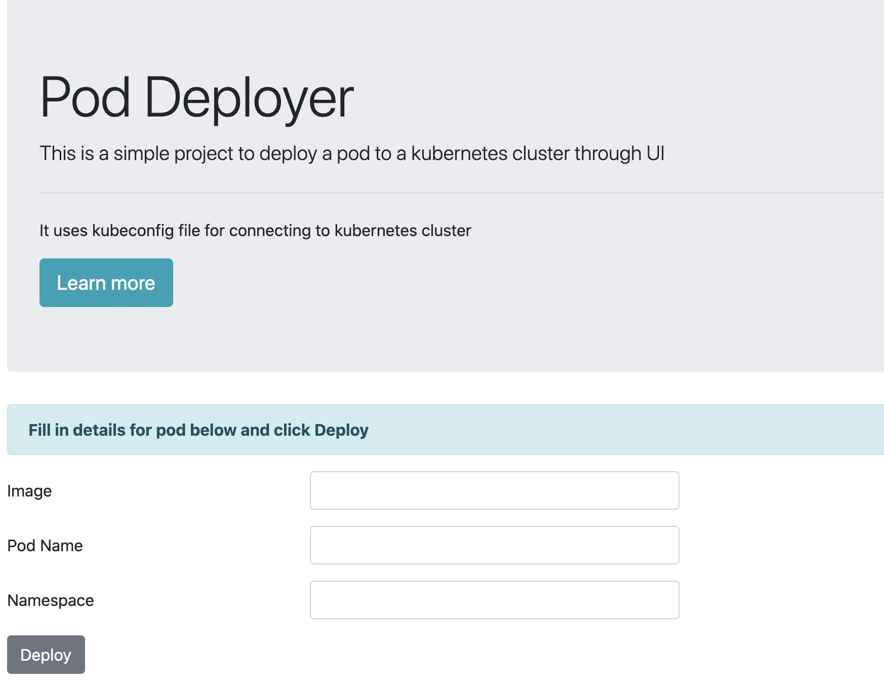

# Pod-Deployer

Simple app to deploy a pod to kubernetes cluster from getting user inputs through UI. It uses kubeconfig from the machine it is accessed.



## Motivation for the project

The motivation for creating this project is to get familiarize with [client-go](https://github.com/kubernetes/client-go) and to learn go web programming.

## Usage

### Pre-requisite

- Running kubernetes cluster and kube config available in the machine
- Since pre-built binary not included you need to build yourself hence you need to have go `1.16+` installed in your system

### Build Locally

Build the application

```go
git clone https://github.com/kube-go/pod-deployer.git
cd pod-deployer
go build
```

#### Execute

```go
./pod-deployer
```

### Docker

```
DATE=
docker build . -t pod-deployer:
```

## TODO

- [ ] Provide exact reason for failure in UI

- [ ] Option to view pod status, description, logs in UI

- [ ] Include binary

## References

- [client-go](https://github.com/kubernetes/client-go)

- [gowebexamples](https://gowebexamples.com/)
